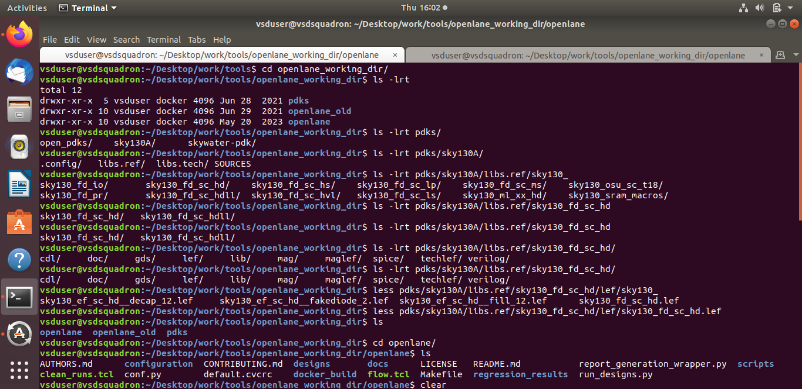

#ASIC DESIGN(RTL to GDS 2)

# Lab Activities:

## DAY 1

### Exploring what's inside SKY130A PDK(An 130nm opensource pdk by google+skywater technologies) 


           
### Performing synthesis while Setting up the openlane flow: 


For invoking the flow, loading required package and design data setup for picorv32a:
```bash
  ./flow.tcl -interactive
   package require openlane 0.9
   prep -design picorv32a
```


```bash
run_synthesis
```

### Activity of the day to calculate the flop ratio for the given design

After succesful completion of synthesis, we will have synthesized netlist as shown below


Flop ratio is given by no:of flops/Total no:of cells in the design * 100
from the snap, = 1613/14876 * 100
               = 0.1084296 * 100
               = 10.84296.

## DAY 2

Running the floor plan

 

```bash
run_floorplan
```
### Explored contents in the def file created inthe below path as show below


### visualizing layout created def using magic tool by entering below commands


```bash
 magic -T ../../openlane_working_dir/pdk/sky130A/libs.tech/magic/sky130A.tech lef read ../../tmp/merged.lef def read picorv32a.floorpln.def &
```


 for selecting a particular instance just hover the mouse pointer to that particular location and press "s", "z" to zoom, "v" to fit to screen.

## For the details of that particular selected instance headover to tkcon window and query with command "what"


# Running Placement
```bash
 run_placement
```


```bash
 magic -T ../../openlane_working_dir/pdk/sky130A/libs.tech/magic/sky130A.tech lef read ../../tmp/merged.lef def read picorv32a.placement.def &
```


## Learnings:
Day 1:
Risc v is an opensource instruction set architecture(ISA) to develop custom processors.
A typical ardino board/ embeded board consists typically a processor(package) and their interfaces, for couarse of time we only concentrate on the processor part.


PDKS are process design kits which are set of libraies provided by the foundary to the desiners inorder to meet the manufacturing criterias.
All the standard cells, macros and ips are placed inside the core.

Day 2:
Floorplan:
utilization ratio = total Area of the netlist/ total core area
Aspect ratio= height/width =1 means square and any other number indicates its rectangular/rectilinear.
dcap cells are placed stratigically near the macros inorder to bypass the sudden surges in current demand i.e., peak current variations.


